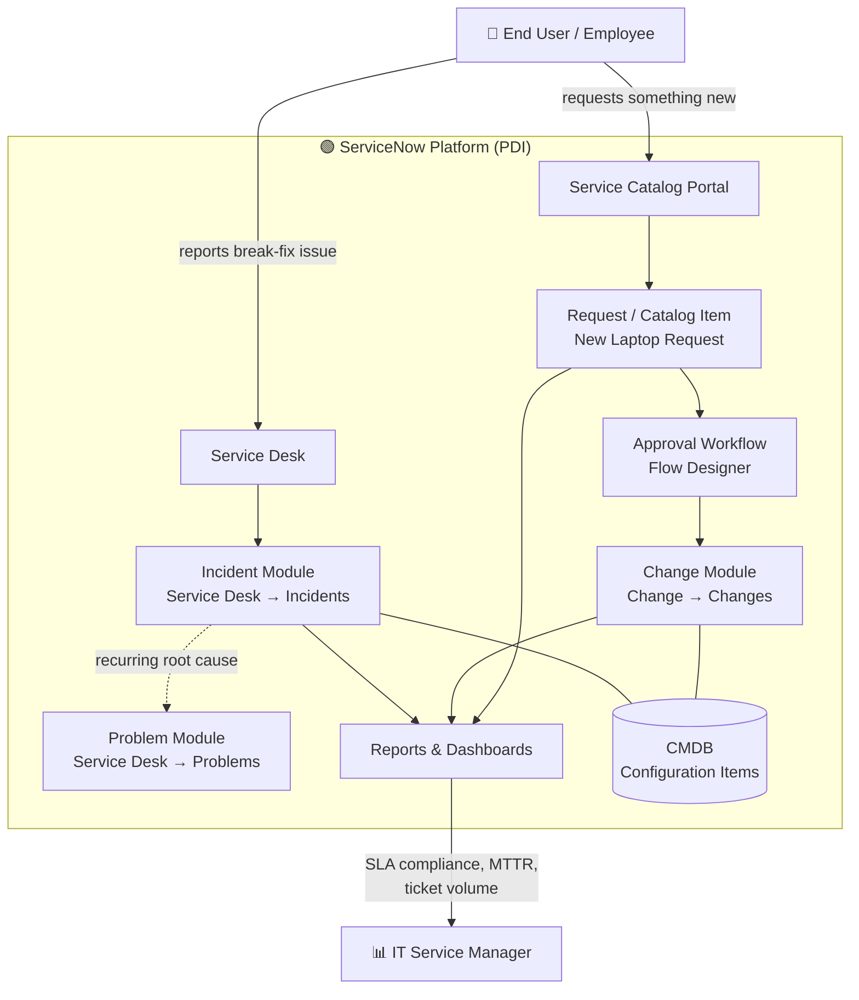
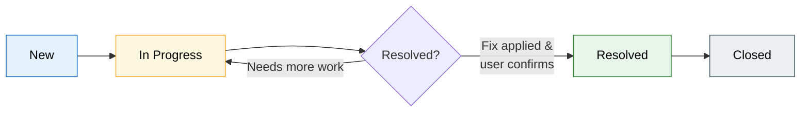
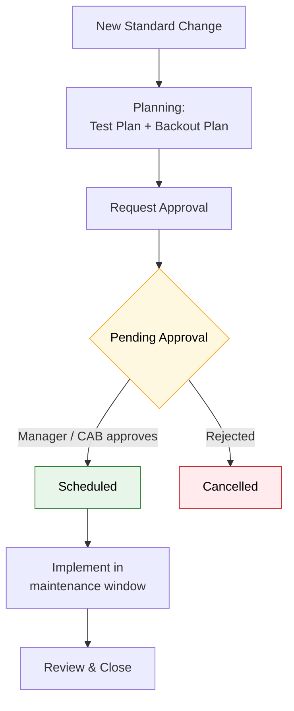

# 🎫 Lab 4 — ServiceNow ITSM (IT Service Management)


> A hands-on IT Service Management lab built on a **free ServiceNow Personal Developer Instance**. It walks through the full incident lifecycle, a self-service catalogue item, a change-approval workflow, and operational reporting — the exact tasks performed daily in enterprise IT support, help desk, sysadmin, and cloud operations roles.

---

## 📋 Lab Overview

| Field | Value |
|---|---|
| **Certification alignment** | CompTIA A+ · Network+ · ITIL 4 Foundation |
| **Free tools** | ServiceNow Personal Developer Instance — free at [developer.servicenow.com](https://developer.servicenow.com), no credit card, no expiration |
| **Time to complete** | 2–3 hours across multiple sessions |
| **Estimated cost** | **$0** — ServiceNow PDI is permanently free |
| **Career relevance** | IT Support · Help Desk · Sysadmin · ITSM Platform Administrator |

---

## 🧩 The Business Problem This Lab Solves

When users report IT problems, those problems need to be **tracked, routed, prioritised, assigned, worked, and resolved** — consistently and auditably. Without a structured system, things fall through the cracks.

> **Scenario:** A production file server goes down at 9:00 AM. Three employees report it — one calls the help desk, one emails a sysadmin directly, one messages a colleague on Teams. Nobody knows who owns the issue. Two technicians unknowingly work the same outage while a third assumes someone else has it. A problem that should have taken one hour to fix takes four, and there is no record of what was done, who approved the fix, or how to prevent it next time.

ServiceNow is how most enterprise IT organisations solve this. It is an **IT Service Management (ITSM)** platform — a structured system for handling every type of IT request, from a password reset to a major infrastructure outage. It enforces process: incidents follow an incident workflow, change requests require approval, and service requests come from a catalogue with predefined fulfilment steps.

ServiceNow is one of the most widely deployed enterprise software platforms in the world. If you are going into IT support, you will use it — or something that works exactly like it — from your first week on the job. Having hands-on experience with it before you start is a meaningful differentiator.

### How this lab maps to real roles

| Role | How this lab applies |
|---|---|
| **IT Support / Help Desk** | Creating and resolving incidents is the core daily task of every help desk role |
| **Sysadmin** | Change management — logging, approving, and documenting infrastructure changes |
| **IT Service Manager** | Building service catalogues, defining workflows, reporting on SLA compliance |
| **Cloud Engineer** | Cloud operations teams use ServiceNow for change requests, incident management, and service requests for cloud resources |

---

## 🎯 What You Will Learn

| Skill | Real-world application |
|---|---|
| Create and resolve an **Incident** | The most common task in every IT support role — done from day one |
| Set ticket **priority and SLA** | Priority determines response time; SLAs define the commitment to the business |
| **Assign** tickets to queues and individuals | Routing is critical — the wrong person working a ticket wastes time and delays resolution |
| Build a **service catalogue item** | Lets users self-serve common requests (laptop, software access, password reset) without calling the help desk |
| Create a **workflow for approvals** | Change and access requests require manager approval before fulfilment — workflows automate this |
| Run **reports** on ticket volume and resolution time | Metrics drive IT operations decisions; pulling and interpreting reports is expected at every level |
| Understand **ITIL incident vs problem vs change** | The three core ITIL process types — every enterprise IT role uses this language |

---

## 🏗️ Architecture

### Platform & Module Map

How a user request flows into ServiceNow and which module handles each request type.



### Incident Lifecycle (Step 3)

The state transitions an incident moves through, from creation to closure.



### Change Approval Workflow (Step 5)

The ITIL control that requires authorisation before a change touches production.



---

## ✅ Prerequisites

- [ ] A valid email address (used to sign up — no credit card required)
- [ ] A modern web browser (Chrome, Edge, or Firefox)
- [ ] ~2–3 hours, which can be split across multiple sessions
- [ ] Basic familiarity with IT support terminology (helpful, not required)

---

## 🚀 Step 1 — Get Your Free Instance

1. Go to [developer.servicenow.com](https://developer.servicenow.com)
2. Click **Sign Up** and create a free account — email and password only, no credit card
3. Once logged in, click **Request Instance**
4. Select the latest stable release (**Washington** or newer)
5. Click **Request** — your instance provisions in 10–15 minutes
6. You will receive an email with your instance URL (format: `dev12345.service-now.com`) and login credentials

> ⚠️ **Keep your instance active.** ServiceNow **hibernates** PDIs that haven't been accessed in **10 days** and **reclaims** instances inactive for more than **30 days**. Log in at least once a week to keep it active. If it gets reclaimed you can request a new one for free — but you lose your work.

---

## 🧭 Step 2 — Navigate the Platform

When you first log in, you are in the ServiceNow admin interface. The left navigation panel gives you access to all modules. The key areas for this lab:

| Module | Where it is | What it does |
|---|---|---|
| **Incident** | Service Desk → Incidents | The primary module for IT support tickets |
| **Problem** | Service Desk → Problems | Root cause analysis for recurring incidents |
| **Change** | Change → Changes | Planned modifications to IT infrastructure |
| **Service Catalog** | Service Catalog → Catalogs | The user-facing request portal |
| **Reports** | Reports → Create New | Analytics and metrics |
| **Workflow Editor** | Process Automation → Flow Designer | Visual workflow builder |

---

## 🎟️ Step 3 — Create and Work an Incident

### Create the Incident

1. Navigate to **Service Desk → Incidents → New**
2. Fill in the form with this scenario:

| Field | Value |
|---|---|
| **Caller** | Search for and select a user from the directory — use **Abel Tuter** as a test user |
| **Category** | Software |
| **Subcategory** | Email |
| **Short description** | User cannot access Outlook — error: Cannot connect to server |
| **Description** | User reports that Outlook stopped working this morning at approximately 9am. Error message: *'Cannot connect to the Exchange server. Verify your network settings.'* Other users in the same building are not affected. User is on a laptop, connected via Wi-Fi. |
| **Priority** | 3 — Moderate (one user affected, workaround available — use webmail) |
| **Assignment Group** | Service Desk |

3. Click **Submit**
4. Note the ticket number (format: `INC0001234`) — this is the tracking ID

### Work the Incident

1. Open the incident you just created
2. Change the **State** to **In Progress**
3. Assign it to yourself — click the **Assigned to** field and search your username
4. Add a **Work Note** (visible to IT staff only):

```
Work Note: Contacted user. Confirmed error message. Outlook profile appears corrupted.
Attempting profile repair. Instructed user to use OWA (webmail) in the interim.
Resolution ETA: 30 minutes.
```

5. Add a resolution in the **Resolution Notes** field:

```
Resolution: Rebuilt Outlook profile. Removed and re-added the Exchange account.
User confirmed Outlook is working. Issue was a corrupted OST file.
Closed with user confirmation.
```

6. Change **State** to **Resolved → Closed**

---

## 🖥️ Step 4 — Build a Service Catalogue Item

Service catalogue items let users request common IT services through a self-service portal without calling the help desk. This reduces ticket volume for routine requests and speeds up fulfilment.

### Create a "New Laptop Request" Item

1. Navigate to **Service Catalog → Catalogs → Service Catalog**
2. Click **Maintain Items → New**
3. Fill in:

| Field | Value |
|---|---|
| **Name** | New Laptop Request |
| **Category** | Hardware |
| **Short description** | Request a new or replacement laptop |
| **Description** | Use this form to request a new laptop for a new hire or to replace a failed or end-of-life device. Requests are reviewed within 2 business days. Delivery takes 5–7 business days after approval. |
| **Fulfillment group** | IT Hardware Team |
| **Price** | Leave blank — internal requests do not have a user-facing cost |

4. Click **Submit** to save the catalogue item
5. Click the **Variables** tab and add these fields:

| Variable Name | Type | Mandatory |
|---|---|---|
| Requester Name | Single Line Text | Yes |
| Business Justification | Multi Line Text | Yes |
| Required By Date | Date | Yes |
| Laptop Model Preference | Select Box (Standard, Developer, Executive) | No |

6. **Save** and **Preview** the item — it now appears in the service catalogue portal

---

## 🔐 Step 5 — Create an Approval Workflow

Change requests require manager approval before work begins. This is a core ITIL control — changes to production infrastructure need authorisation to prevent uncoordinated modifications that could cause outages.

1. Navigate to **Change → Changes → New (Standard)**
2. Fill in a sample change request:

| Field | Value |
|---|---|
| **Short description** | Deploy security patch MS24-001 to all Windows workstations |
| **Category** | Software |
| **Risk** | Low |
| **Impact** | 2 — Medium |
| **Start date** | Next Saturday at 2:00 AM |
| **End date** | Next Saturday at 6:00 AM |
| **Description** | Monthly security patch deployment. Patch addresses CVE-2024-0001 rated CVSS 7.8. Workstations will require one reboot. Deployed via WSUS. Rollback plan: uninstall via WSUS if issues reported post-deployment. |

3. Under the **Planning** tab, add a **Test Plan** and **Backout Plan**
4. Click **Request Approval** — this moves the change to **Pending Approval** state
5. Navigate back to the change and find the **Approvals** tab — approve it as the admin user
6. The change moves to **Scheduled** state

---

## 📊 Step 6 — Build a Report

1. Navigate to **Reports → Create New**
2. **Name:** `Incident Volume by Priority — Last 30 Days`
3. **Data:** Incident `[incident]`
4. **Type:** Bar Chart
5. **Group by:** Priority
6. Add a condition: **Created is on or after 30 days ago**
7. Click **Save and Run**

Build two more reports for your portfolio:

- **Mean Time to Resolution (MTTR)** — bar chart grouped by Assignment Group
- **Open Incidents by Assigned Agent** — useful for workload balancing

---

## 💡 ITIL Concepts to Know

These terms come up in every IT support interview and are tested in ITIL Foundation. Understanding how they map to ServiceNow makes them concrete.

| ITIL Term | Definition | ServiceNow Module |
|---|---|---|
| **Incident** | An unplanned interruption to a service. Goal: restore service as quickly as possible. | Service Desk → Incidents |
| **Problem** | The root cause of one or more incidents. Goal: eliminate the root cause permanently. | Service Desk → Problems |
| **Change** | A planned modification to infrastructure or applications. Goal: implement with minimal risk. | Change → Changes |
| **Service Request** | A user request for something new (access, hardware, information). Not a break/fix. | Service Catalog |
| **SLA** | Service Level Agreement — the committed response and resolution time for each priority level. | SLA → SLA Definitions |
| **CMDB** | Configuration Management Database — the record of every IT asset and its relationships. | Configuration → CIs |
| **Knowledge Base** | Articles documenting known issues and their solutions — reduces repeat incident volume. | Knowledge → Articles |

---

## 📸 Portfolio Evidence

> Take screenshots of each deliverable below and drop them into a `/screenshots` folder in this repo. Each paragraph explains what process the artifact supports and why it matters in an IT environment.

### 1. Completed Incident (Work Notes + Resolution)


This is the closed `INC` record showing the full lifecycle — caller, category, priority, the internal work note, and the resolution notes. It demonstrates the **incident management** process: the single most common task in IT support. Every break-fix issue an end user reports is captured here so it is tracked, owned by one person, worked with an audit trail, and closed only after the user confirms the fix. This is what prevents the "three people, three technicians, four-hour outage" problem described at the top of this lab.

### 2. Service Catalogue Item


This is the **New Laptop Request** catalogue item with its variables (requester name, business justification, required-by date, model preference). It demonstrates the **service request** process. Instead of calling the help desk for routine requests, users self-serve through a structured form that captures everything the fulfilment team needs up front. This reduces ticket volume, standardises intake, and speeds up delivery — a direct efficiency win for any IT organisation.

### 3. Change Request with Approval


This is the standard change request for the security-patch deployment, showing it moving to **Scheduled** after approval. It demonstrates **change management** — the ITIL control that requires authorisation, a test plan, and a backout plan before anything touches production. This is what keeps infrastructure changes coordinated and prevents an uncoordinated modification from causing an outage. It also produces the paper trail auditors and change advisory boards require.

### 4. Dashboard Report


This is the **Incident Volume by Priority — Last 30 Days** bar chart. It demonstrates **operational reporting**. Metrics like ticket volume, MTTR, and open incidents per agent are how IT managers spot trends, balance workload, measure SLA compliance, and justify staffing. Being able to pull and interpret these reports is expected at every level of an IT career.

---

## 🛠️ Tools & Technologies


- **ServiceNow PDI** — free enterprise ITSM platform
- **Flow Designer** — visual approval-workflow builder
- **Incident / Problem / Change / Service Catalog** modules
- **Reports & Dashboards** — ticket volume, MTTR, agent workload

---

## 🔗 Related Labs

- [Azure AD / Entra ID Administration Lab](https://github.com/glenpagesr-dev/azure-ad-admin-lab) — identity, RBAC, and directory management

---

## 👤 Author

**Glen Page** — Cloud Support Engineer. CompTIA Security+ certified, with hands-on Microsoft Azure and ServiceNow ITSM experience.

- GitHub: [@glenpagesr-dev](https://github.com/glenpagesr-dev)
- LinkedIn: [glen-page-862730246](https://www.linkedin.com/in/glen-page-862730246)

---

> ℹ️ **Note:** All configuration in this lab is performed on a free ServiceNow Personal Developer Instance for learning and portfolio purposes only. Values such as caller names (Abel Tuter) are ServiceNow's built-in demo data.
